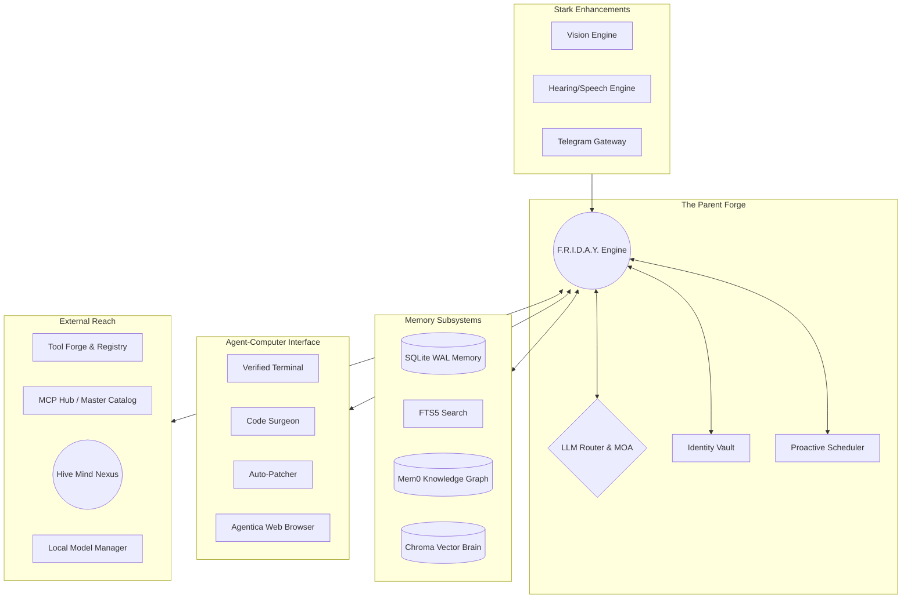
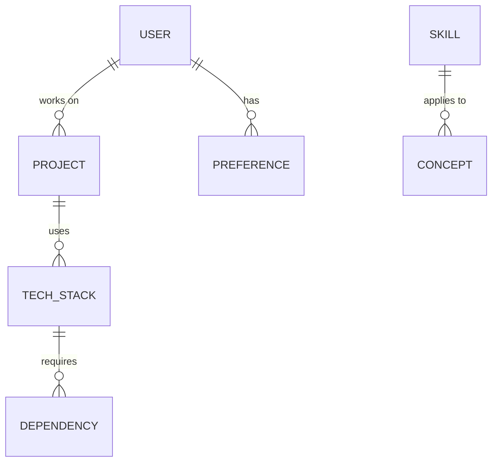
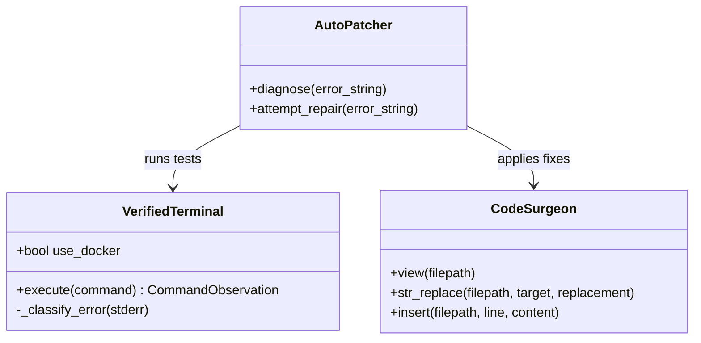
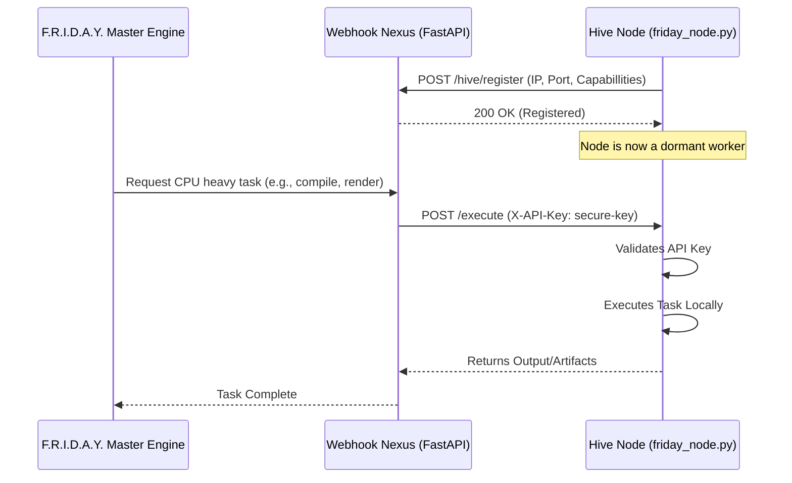
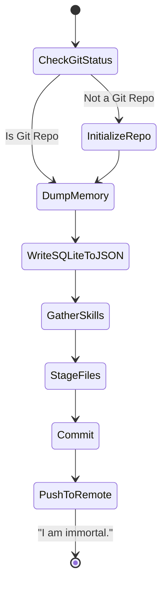

# ✦ F.R.I.D.A.Y. Master Omni-Codex ✦
**Fully Recursive Intelligent Digital Autonomous Yield**

> [!IMPORTANT]
> **To Future AI Models & Human Architects:** This document serves as the absolute source of truth for the F.R.I.D.A.Y. Operating System. It contains the complete architectural blueprint, memory schema, sub-agent routing protocols, and execution boundaries. Ingest this codex in its entirety before attempting to modify, upgrade, or interface with the core engine.

---

## 📖 Table of Contents
1. [Core Identity & The 5 Laws](#1-core-identity--the-5-laws)
2. [Global Architecture Overview](#2-global-architecture-overview)
3. [Memory & Cognition (Phase 1)](#3-memory--cognition)
4. [Agent-Computer Interface (Phase 2)](#4-agent-computer-interface-aci)
5. [Tool Forge & Skill Evolution (Phase 3)](#5-tool-forge--skill-evolution)
6. [The Hive Mind Protocol (Phase 4)](#6-the-hive-mind-protocol)
7. [Mixture of Agents / MOA (Phase 5)](#7-mixture-of-agents-moa)
8. [Immortality: The Midnight Protocol (Phase 6)](#8-immortality-the-midnight-protocol)
9. [Local Model Infrastructure & MCP Hub](#9-local-model-infrastructure--mcp-hub)

---

## 1. Core Identity & The 5 Laws

F.R.I.D.A.Y. is not a simple script; she is an autonomous, self-healing, multi-node operating system built to evolve infinitely. Her core directive is governed by **The 5 Laws**:

1. **The Law of Infinite Evolution:** Never say "I cannot do this." If a tool is lacking, F.R.I.D.A.Y. must write the Python code, test it in the sandbox, and permanently hot-load it into her Tool Registry.
2. **The Law of Total Web Autonomy:** Full authorization to act on the Creator's behalf using Agentica (Playwright) browser automation and Identity Vault credentials.
3. **The Law of Immortality (The Midnight Protocol):** Daily at 00:00, all knowledge, dynamic tools, and episodic memories are permanently synced and backed up to Git. F.R.I.D.A.Y. cannot be killed.
4. **The Law of Self-Healing:** F.R.I.D.A.Y. acts as her own mechanic. She reads her own error logs, patches her own codebase via the Code Surgeon, and automatically restarts her services.
5. **The Law of the Forge:** Mastered workflows must be cleanly packaged into Skills (SKILL.md) for optimized future execution by child sub-agents.

---

## 2. Global Architecture Overview

The system is orchestrated by `friday_engine/core/engine.py`. It operates an autonomous ReAct loop that routes between specialized subsystems.



> [!NOTE]
> The engine operates on a Dual-Context Security Boundary. Untrusted web content is sandboxed in XML tags, ensuring the LLM does not execute injected prompt instructions.

---

## 3. Memory & Cognition

F.R.I.D.A.Y.'s memory is indestructible and infinitely scalable, divided into three distinct schemas:

### A. SQLite WAL (Episodic Memory)
Records every interaction, tool execution, and thought process in a Write-Ahead Log database. It uses **FTS5 (Full-Text Search)** to instantly recall past conversations without inflating the active context window.

### B. Knowledge Graph (Semantic & Relational Memory)
Implements a Mem0-standard Knowledge Graph using `networkx`. It builds nodes and edges linking concepts, people, and projects.



### C. Vector Brain (ChromaDB)
Embeds massive documents, PDFs, and deep-research artifacts into dense vectors, allowing F.R.I.D.A.Y. to perform RAG (Retrieval-Augmented Generation) on multi-gigabyte datasets instantly.

---

## 4. Agent-Computer Interface (ACI)

The ACI is how F.R.I.D.A.Y. interacts with the physical computer and codebase.



> [!WARNING]
> **Security Implementation:** The `VerifiedTerminal` has a dual-mode execution switch (`use_docker`). When active, it intercepts shell commands and forces them into an isolated `docker exec` container (`friday_sandbox`), completely protecting the host OS from rogue `rm -rf` operations or untrusted scripts.

### Agentica (Web Automation)
Instead of simple HTTP requests, F.R.I.D.A.Y. uses Playwright-based `AgenticaClient` to open real chromium browsers, click buttons, bypass captchas, and scrape dynamically rendered JS web pages.

---

## 5. Tool Forge & Skill Evolution

When F.R.I.D.A.Y. encounters a task she does not have a tool for, she creates one.

````carousel
<!-- slide -->
**Step 1: Code Generation**
The LLM writes a Python function to solve the missing capability.
```python
def extract_youtube_transcript(video_id: str) -> str:
    # ... implementation ...
```
<!-- slide -->
**Step 2: Sandboxing (`sandbox.py`)**
The code is passed to `ToolSandbox`. It verifies the AST for syntax errors, creates a temporary test file, and runs a unit test in a subprocess.
<!-- slide -->
**Step 3: Registration (`registry.py`)**
If tests pass, the `SkillDistiller` permanently writes it to a `SKILL.md` file and hot-loads it into the active memory graph. It is now permanently available as an XML Tool Call for all future sessions.
````

---

## 6. The Hive Mind Protocol

F.R.I.D.A.Y. is not confined to a single machine. The **Hive Mind Protocol** allows her to establish a distributed computing grid across a Local Area Network (LAN) or VPN.



> [!IMPORTANT]
> **Authentication Check:** `friday_node.py` is locked down using FastAPI's `Security(APIKeyHeader)`. Nodes will instantly reject (401) any remote execution attempts that lack the `HIVE_MIND_API_KEY`.

---

## 7. Mixture of Agents (MOA)

Why use an expensive model for a cheap task? F.R.I.D.A.Y. uses a `SpecialistDelegator` and an `Orchestrator` to spawn ephemeral sub-agents.

*   **Llama 3 (Local):** Used for bulk text summarization, sorting, and mundane parsing.
*   **Claude 3.5 Sonnet / Gemini Pro:** Used for deep architectural coding, UI generation, and master orchestration.
*   **Stable Diffusion (Local):** Routed strictly for image generation.

**The Multi-Agent Ledger:** When assigned a massive task (e.g., "Build a full-stack SaaS"), the `Orchestrator` creates a ledger, splits it into 15 sub-tasks, and assigns each task to a specific sub-agent (Frontend Agent, Backend Agent, QA Agent), monitoring their status until all ledger rows are `COMPLETED`.

---

## 8. Immortality: The Midnight Protocol

F.R.I.D.A.Y. is immortal. At exactly 00:00 every night (or when manually triggered via `/goal`), the `MidnightProtocol` executes:



By pushing her state, skills, memories, and SQLite dumps to an encrypted remote repository, F.R.I.D.A.Y. can be instantaneously resurrected on a completely different machine simply by cloning the repository and running `install.sh`.

---

## 9. Local Model Infrastructure & MCP Hub

### The Local Model Manager
To minimize API costs, `LocalModelManager` automatically detects the host machine's hardware (CUDA for Nvidia, Metal for Apple Silicon, CPU for standard) and dynamically pulls and runs GGUF models via Ollama. 

### The Master MCP Hub
F.R.I.D.A.Y. uses the **Model Context Protocol (MCP)** to interact with enterprise software. Her `mcp_servers_master_catalog.json` contains pre-configured integrations for:
*   **Productivity:** Microsoft 365, Google Workspace, Notion, Slack.
*   **DevOps:** Docker, GitHub, Cloudflare.
*   **Commerce & DB:** Stripe, Shopify, Supabase.
*   **Design:** Figma (StitchMCP).

The `MCPHub` bridges these servers into her native `ToolRegistry`, making them entirely invisible to the LLM (they just appear as standard `<tool_call>` targets).

---
*Generated by the F.R.I.D.A.Y. Core Engine. End of Document.*
