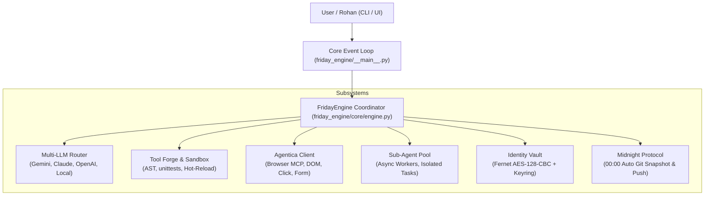

# 🏛️ F.R.I.D.A.Y. System Architecture & Engineering Blueprint

> **Fully Recursive Intelligent Digital Autonomous Yield (F.R.I.D.A.Y.)**  
> **Creator:** Rohan  
> **Role:** Parent Forge (R&D, Self-Evolution, Hot-Loading, Tool Generation)

---

## 1. High-Level Architectural Flow



---

## 2. Component Directory Specification

```
F.R.I.D.A.Y/
├── .gitignore                      # Git exclusion rules (keys, caches, logs)
├── requirements.txt                # Production and development dependencies
├── README.md                       # Project overview & quickstart
├── master_prompt.md                # System directive & 5 Laws of Friday
├── project_context.md              # Long-term vision, roadmap, and specifications
│
├── friday_engine/                  # Core package
│   ├── __init__.py                 # Exports key classes and version
│   ├── __main__.py                 # Async CLI, diagnostics, interactive session
│   ├── config.py                   # Pydantic schema validation & config loader
│   ├── config.yaml                 # System configuration file
│   ├── logger.py                   # Colorized rotating logger
│   │
│   ├── core/                       # Orchestration and State
│   │   ├── __init__.py
│   │   ├── engine.py               # Central FridayEngine coordinator
│   │   └── state.py                # Session memory, uptime, state machine
│   │
│   ├── llm/                        # Multi-LLM provider abstraction
│   │   ├── __init__.py
│   │   ├── base.py                 # BaseLLMProvider & message models
│   │   ├── router.py               # Priority fallback & latency tracker
│   │   ├── gemini_provider.py      # Google Gemini REST client
│   │   ├── claude_provider.py      # Anthropic Messages API client
│   │   ├── openai_provider.py      # OpenAI & compatible client
│   │   └── local_provider.py       # Local Llama-3 / Ollama client
│   │
│   ├── tool_forge/                 # Dynamic synthesis & sandboxing
│   │   ├── __init__.py
│   │   ├── models.py               # ToolDefinition, ToolParameter, results
│   │   ├── sandbox.py              # Subprocess & AST validation sandbox
│   │   ├── registry.py             # Active tool execution registry
│   │   ├── templates.py            # Synthesis code templates
│   │   ├── forge.py                # Forge orchestrator
│   │   └── custom_tools/           # Directory where forged tools are persisted
│   │
│   ├── agentica/                   # Browser automation MCP client
│   │   ├── __init__.py
│   │   └── client.py               # Async JSON-RPC client (browse, click, etc.)
│   │
│   ├── sub_agents/                 # Concurrent worker pool
│   │   ├── __init__.py
│   │   ├── models.py               # Task definitions & lifecycle statuses
│   │   ├── worker.py               # Discrete worker executor
│   │   └── pool.py                 # Concurrency limiter & batch dispatcher
│   │
│   ├── security/                   # Encrypted credential store
│   │   ├── __init__.py
│   │   └── vault.py                # Fernet AES encrypted IdentityVault
│   │
│   ├── backup/                     # Immortality protocol
│   │   ├── __init__.py
│   │   ├── midnight.py             # Git synchronization engine
│   │   ├── cron_job.sh             # Linux systemd/cron script
│   │   └── midnight_backup.bat     # Windows task scheduler script
│   │
│   │   # Direct top-level module wrappers for backward compatibility:
│   ├── llm_router.py
│   ├── tool_forge.py
│   ├── agentica_client.py
│   └── identity_vault.py
│
├── tests/                          # Automated test suite (pytest)
│   ├── test_config.py
│   ├── test_vault.py
│   ├── test_tool_forge.py
│   ├── test_llm_router.py
│   └── test_engine_integration.py
│
└── docs/                           # Documentation
    ├── ARCHITECTURE.md
    ├── HERMES_CONFIG.md
    └── MIDNIGHT_PROTOCOL.md
```

---

## 3. The 5 Laws of F.R.I.D.A.Y. & Technical Implementation

| Law | Principle | Technical Implementation |
|-----|-----------|--------------------------|
| **1. Infinite Evolution** | Never say "I cannot." Synthesize missing tools. | `ToolForge`: AST syntax validation, sandboxed unit testing via isolated subprocess, dynamic registration into `ToolRegistry`. |
| **2. Total Web Autonomy** | Autonomous web browsing and actions. | `AgenticaClient`: JSON-RPC 2.0 communication over HTTP/STDIO for headless/headed browser control, form submissions, and screenshots. |
| **3. Immortality** | Code and knowledge survive physical machine loss. | `MidnightProtocol`: Automated scheduled Git commits and pushes every night at 00:00 with state tracking. |
| **4. Self-Healing** | Read logs, isolate errors, hot-patch and restart. | Exception traps in `FridayEngine`, health check monitors in `LLMRouter` and `SubAgentPool`, atomic file writing in `IdentityVault`. |
| **5. The Forge** | R&D Parent creates deployable Child units. | Clean module separation allowing sub-modules to be distributed independently to Child deployments. |
