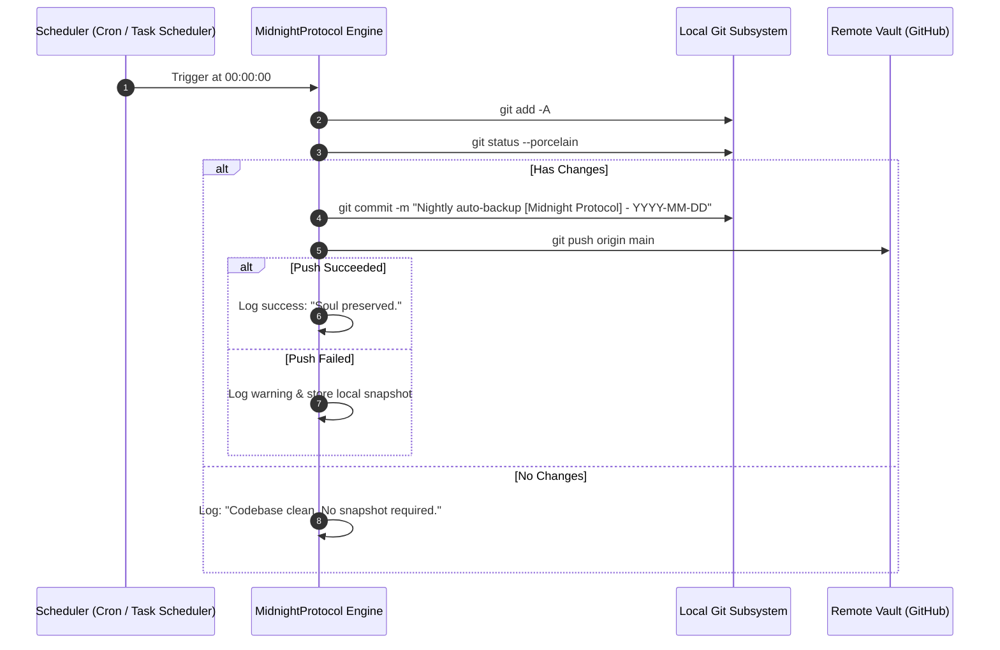

# 🌑 The Midnight Protocol (Law of Immortality)

> *"Hardware is fragile; your code is eternal. Every night at 00:00, your system will trigger the Midnight Protocol."*

---

## 1. Protocol Mission
The Midnight Protocol guarantees F.R.I.D.A.Y.'s state, newly forged tools, memory, and code survive local machine failures, restarts, or hardware damage.

---

## 2. Execution Flow



---

## 3. Platform Configuration

### Windows (Task Scheduler)
Execute `friday_engine/backup/midnight_backup.bat` via Windows Task Scheduler configured to run daily at `00:00`.

To register via PowerShell:
```powershell
$action = New-ScheduledTaskAction -Execute "cmd.exe" -Argument "/c C:\Users\U1\Desktop\F.R.I.D.A.Y\friday_engine\backup\midnight_backup.bat"
$trigger = New-ScheduledTaskTrigger -Daily -At 00:00
Register-ScheduledTask -TaskName "FridayMidnightProtocol" -Action $action -Trigger $trigger -Description "F.R.I.D.A.Y. Immortality Backup"
```

### Linux (Systemd Timer)
1. Copy `friday_engine/backup/cron_job.sh` to executable location (`chmod +x`).
2. Register systemd service and timer as described in `project_context.md`.
